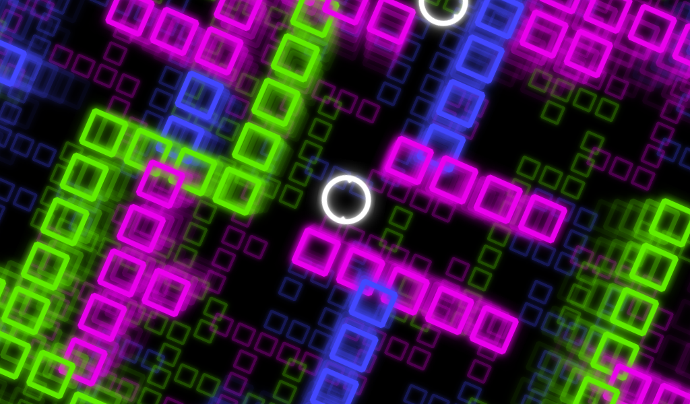

# Neon Maze

Ejemplo de [Godot Engine](https://godotengine.org/) para mostrar la mecánica de rotación de escenario. Está descrito con más detalle en [un artículo del blog de Zenvoid Studio](https://games.zenvoid.org/blog/videojuegos/rotacion-del-escenario/). No tiene reglas ni objetivos, es una escena simple que utiliza *TileMap*, el [efecto de pseudo 3D](https://godotengine.org/article/godot-32-will-get-pseudo-3d-support-2d-engine), y varios objetos de tipo *RigidBody2D*.

Este concepto lo hemos utilizado anteriormente para hacer [mini juegos sencillos](https://games.zenvoid.org/blog/videojuegos/regreso-al-pasado/), especialmente pensados como ejercicio para quienes están aprendiendo a utilizar un motor de videojuegos.

---

**English**: [Godot Engine](https://godotengine.org/) example for scenery rotation mechanics. It's discussed with more detail on an [article written in Zenvoid Studio's blog](https://games.zenvoid.org/blog/videojuegos/rotacion-del-escenario/) (in Spanish). There are no rules nor objectives, it's a simple scene that uses *TileMap*, the [pseudo 3D effect](https://godotengine.org/article/godot-32-will-get-pseudo-3d-support-2d-engine), and several *RigidBody2D* objects.

We've used this concept previously to make [simple mini games](https://games.zenvoid.org/blog/videojuegos/regreso-al-pasado/), well suited as exercises for people learning to use a videogame engine.
